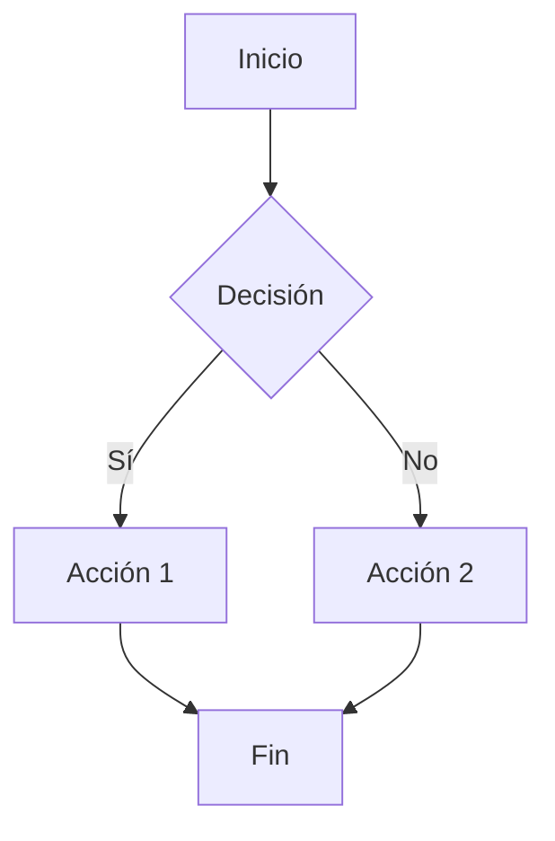
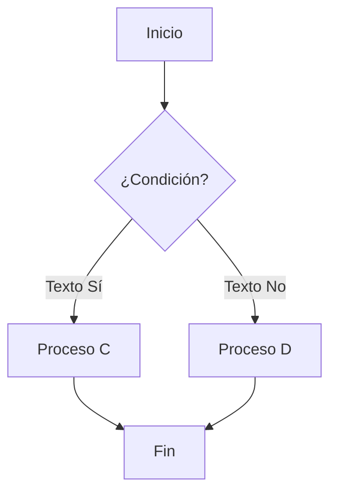
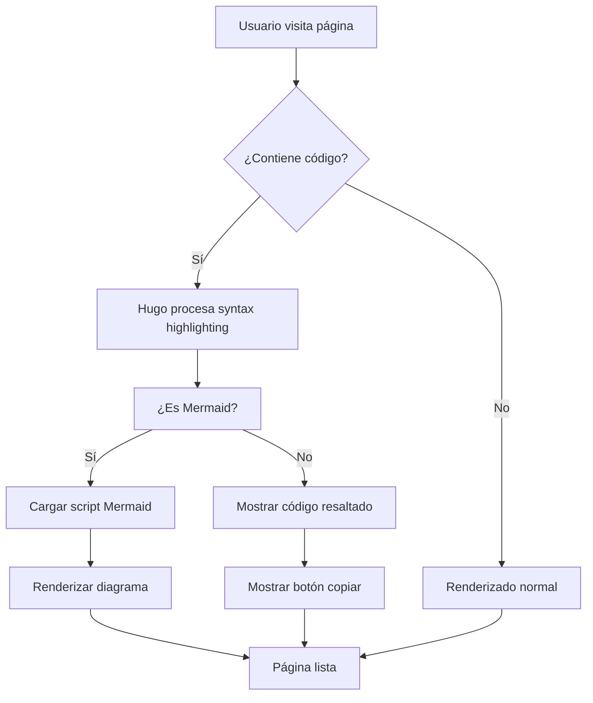
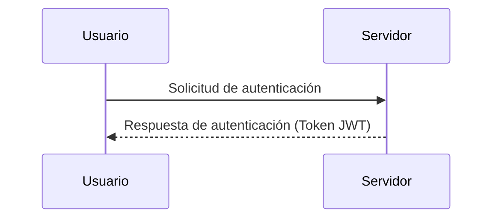
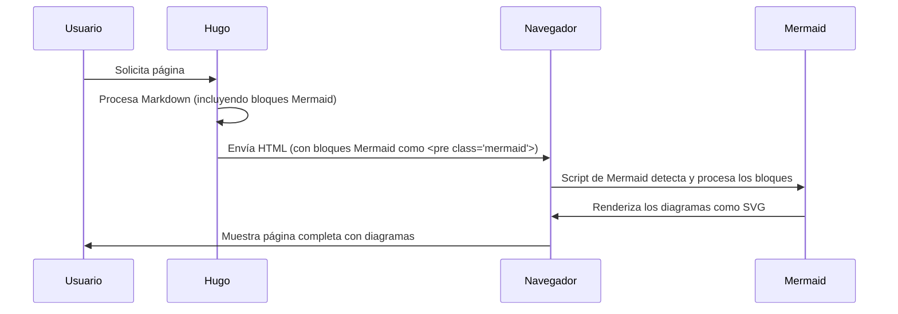
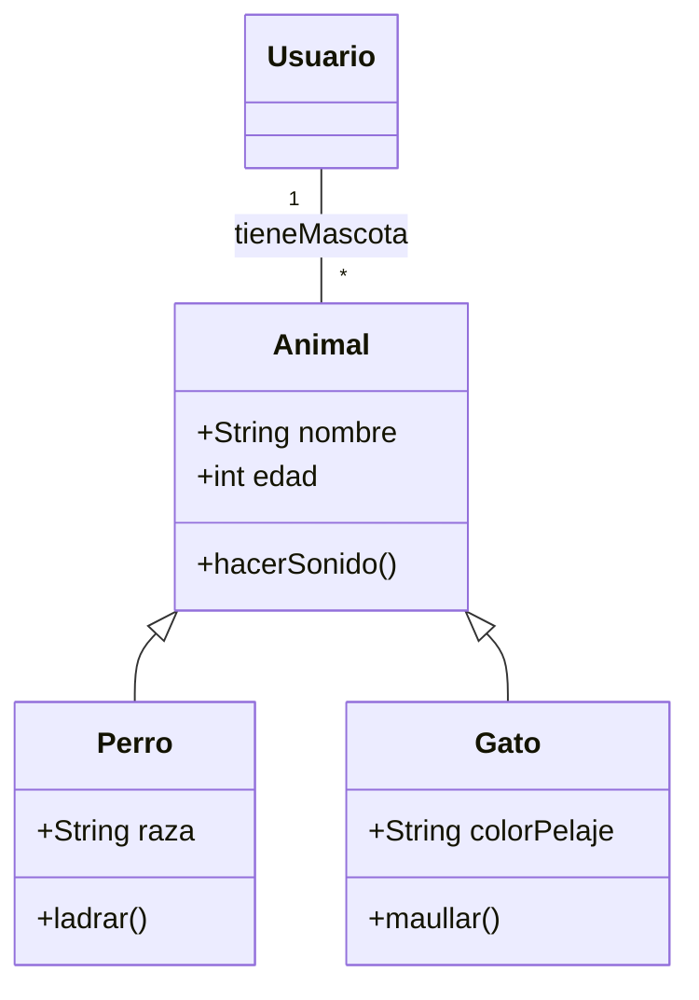
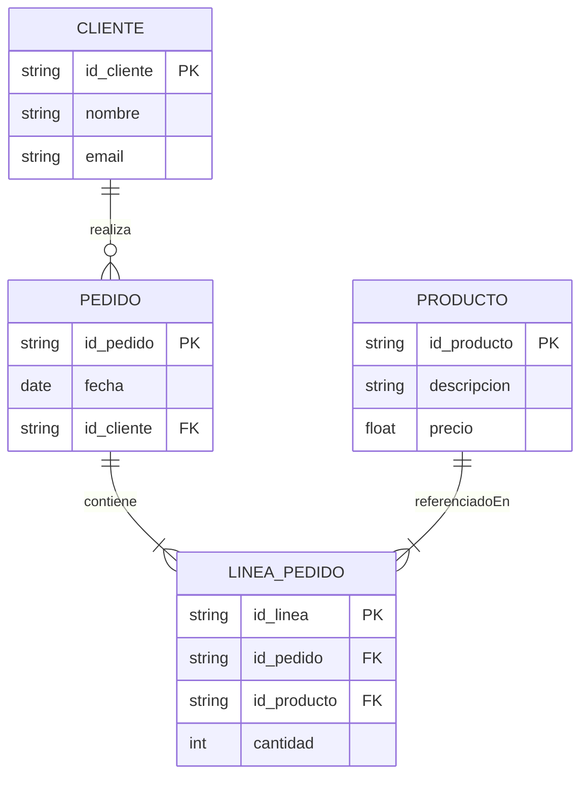
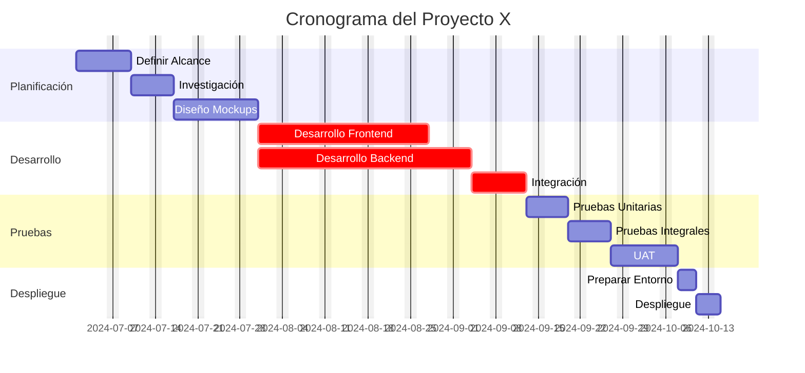
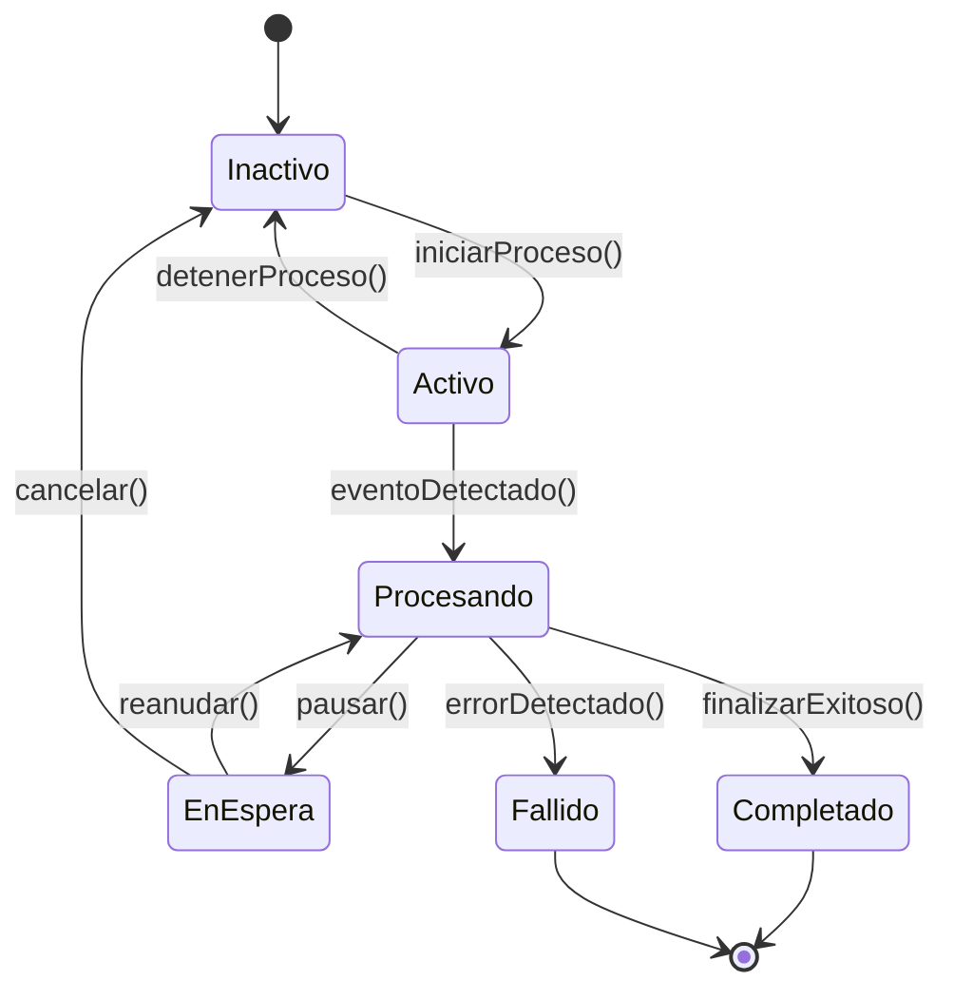
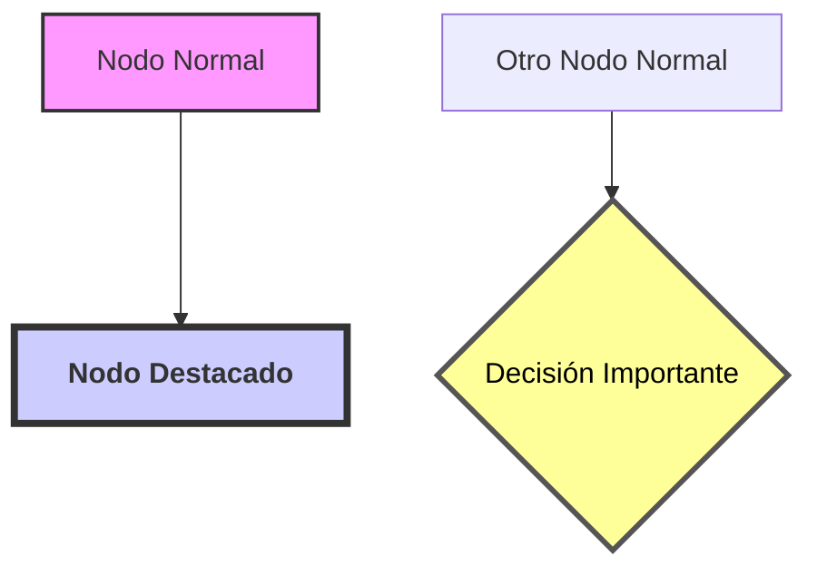

# 🎨 Integración y Uso de Diagramas Mermaid en Hugo

Los diagramas Mermaid te permiten crear una amplia variedad de visualizaciones complejas (diagramas de flujo, secuencia, Gantt, etc.) directamente desde texto, de manera similar a Markdown. En este sitio, el soporte para Mermaid ya está configurado y listo para que lo uses en tus posts.

## 🚀 Cómo Usar Mermaid

Para crear un diagrama Mermaid en cualquier post, simplemente usa un bloque de código estándar de Markdown con el lenguaje especificado como `mermaid`:

````markdown

````

Hugo y el script de Mermaid se encargarán de renderizar este bloque de texto como un diagrama SVG interactivo.

## 📊 Tipos de Diagramas Disponibles (Ejemplos)

Mermaid soporta una gran cantidad de tipos de diagramas. Aquí algunos ejemplos:

### 1. Diagramas de Flujo (Flowchart)

Ideal para representar procesos, algoritmos o flujos de trabajo.

**Ejemplo Básico:**


**Ejemplo Más Complejo (Tomado de pruebas del sitio):**


### 2. Diagramas de Secuencia (Sequence Diagram)

Muestra cómo los objetos interactúan entre sí a lo largo del tiempo.

**Ejemplo Básico:**


**Ejemplo Más Detallado (Tomado de pruebas del sitio):**


### 3. Diagramas de Clases (Class Diagram)

Para modelar la estructura de un sistema orientada a objetos.


### 4. Diagramas de Entidad-Relación (Entity Relationship Diagram)

Para modelar bases de datos.


### 5. Diagramas de Gantt (Gantt Chart)

Para planificación de proyectos y visualización de cronogramas.


### 6. Diagramas de Estado (State Diagram)

Para describir el comportamiento de un sistema a través de sus estados y transiciones.

Para muchos más tipos de diagramas (Pie, Git, User Journey, Mindmap, etc.), consulta la [documentación oficial de Mermaid](https://mermaid.js.org/syntax/examples.html).

## 🎨 Personalización y Estilos

Mermaid permite cierta personalización directamente en el código del diagrama, como definir estilos para nodos específicos:


También puedes usar directivas de tema o inicialización para aplicar configuraciones globales si el script de carga lo permite.

## 🔧 Configuración Técnica (Cómo está implementado en este sitio)

El soporte para Mermaid en este sitio Hugo se ha implementado mediante:

1.  **Render Hook para Bloques de Código**:
    Un archivo como `layouts/_default/_markup/render-codeblock-mermaid.html` (o una lógica similar dentro de un `render-codeblock.html` más general) se encarga de detectar los bloques de código con lenguaje `mermaid`. En lugar de pasarlos a Chroma para resaltado de sintaxis, los envuelve en una etiqueta `<pre class="mermaid">` (o similar) para que el script de Mermaid los pueda encontrar y procesar.

    Ejemplo de `render-codeblock-mermaid.html`:
    ```html
    <pre class="mermaid">
      {{- .Inner | safeHTML -}}
    </pre>
    {{- .Page.Store.Set "hasMermaid" true -}} 
    ```
    El `.Page.Store.Set "hasMermaid" true` es una forma de marcar que la página actual contiene al menos un diagrama Mermaid.

2.  **Script de Carga de Mermaid**:
    En la plantilla base del sitio (generalmente `layouts/_default/baseof.html`), se incluye el script de Mermaid. Este script se carga condicionalmente solo si la página actual tiene diagramas Mermaid (usando la variable `hasMermaid` que se estableció en el render hook).

    Ejemplo al final del `<body>` en `baseof.html`:
    ```html
    {{ if .Store.Get "hasMermaid" }}
      <script type="module">
        import mermaid from 'https://cdn.jsdelivr.net/npm/mermaid@10/dist/mermaid.esm.min.mjs';
        mermaid.initialize({ startOnLoad: true });
      </script>
    {{ end }}
    ```
    Esto utiliza la versión ESM de Mermaid desde un CDN (jsDelivr es una opción popular).

## 💡 Consejos y Mejores Prácticas

1.  **Mantén los Diagramas Simples**: Evita crear diagramas excesivamente complejos que se vuelvan difíciles de leer y entender en una pantalla.
2.  **Usa Etiquetas Descriptivas**: Nombres claros y concisos para nodos, actores y conexiones mejoran la comprensión.
3.  **Aprovecha los Estilos con Moderación**: Usa colores y estilos para destacar elementos importantes, pero no sobrecargues visualmente el diagrama.
4.  **Documenta Diagramas Complejos**: Si un diagrama es intrínsecamente complejo, considera acompañarlo con una explicación en texto.
5.  **Revisa la Sintaxis**: Mermaid tiene su propia sintaxis. Consulta la documentación oficial si algo no se renderiza como esperas.
6.  **Prueba en Diferentes Navegadores/Dispositivos**: Asegúrate de que tus diagramas se vean bien en los principales navegadores y en dispositivos móviles.

## 🔗 Enlaces Útiles

-   [**Documentación Oficial de Mermaid**](https://mermaid.js.org/): La fuente principal para sintaxis, tipos de diagramas y configuración.
-   [**Editor en Línea de Mermaid (Live Editor)**](https://mermaid.live/): Excelente para probar y crear diagramas rápidamente.
-   [**Galería de Ejemplos de Mermaid**](https://mermaid.js.org/syntax/examples.html): Para ver la variedad de diagramas que puedes crear.

Con Mermaid integrado en Hugo, tienes una herramienta poderosa para enriquecer tu contenido con visualizaciones claras y efectivas.
