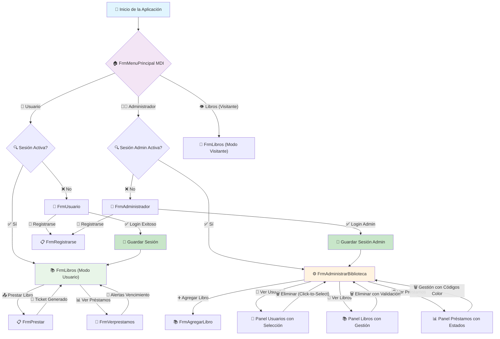
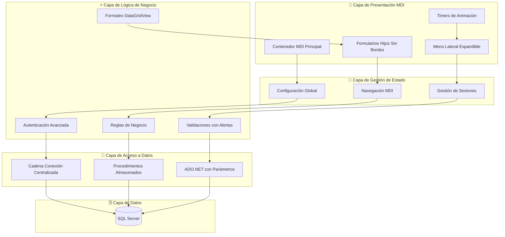
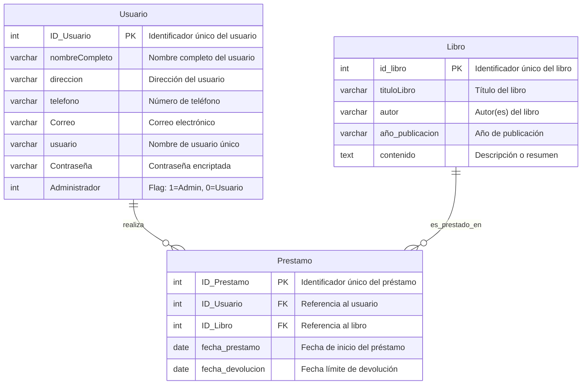
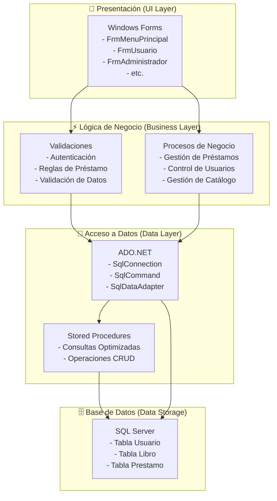

<a href="https://dotnet.microsoft.com/download/dotnet-framework"></a>
<a href="https://www.microsoft.com/sql-server"></a>
<a href="https://docs.microsoft.com/dotnet/desktop/winforms/"></a>
<a href="LICENSE"></a>


**BibliotecaForm** es un sistema de gestión de bibliotecas robusto y fácil de usar, desarrollado en C# con Windows Forms. Ofrece una interfaz MDI moderna y funcionalidades completas para la administración de libros, usuarios y préstamos, ideal para pequeñas y medianas bibliotecas.

Este proyecto nació de la necesidad de contar con una herramienta eficiente y visualmente atractiva para la gestión bibliotecaria, enfocándose en la experiencia del usuario y la solidez funcional.

## 📋 Tabla de Contenidos

- [✨ Características Principales](#-características-principales)
- [📸 Capturas de Pantalla](#-capturas-de-pantalla)
- [🛠️ Tecnologías Utilizadas](#️-tecnologías-utilizadas)
- [💻 Requisitos del Sistema](#-requisitos-del-sistema)
- [🚀 Instalación y Configuración](#-instalación-y-configuración)
- [🏗️ Arquitectura del Sistema](#-arquitectura-del-sistema)
- [🔧 Módulos y Funcionalidades](#-módulos-y-funcionalidades)
- [🗄️ Base de Datos](#️-base-de-datos)
- [📁 Estructura del Proyecto](#-estructura-del-proyecto)
- [🚀 Uso de la Aplicación](#-uso-de-la-aplicación)
- [🤝 Contribución](#-contribución)
- [📜 Licencia](#-licencia)
- [🧑‍💻 Autor](#-autor)

## ✨ Características Principales

- 🔐 **Sistema de Autenticación Multi-Rol con Gestión de Sesiones**: Soporte para usuarios regulares y administradores con persistencia de sesión.
- 🖥️ **Interfaz MDI Moderna**: Menú lateral expandible/colapsable con navegación fluida entre formularios.
- 📚 **Gestión Completa de Catálogo**: Agregar, editar y eliminar libros del inventario con validaciones avanzadas.
- 👥 **Administración de Usuarios**: Registro y gestión de miembros con selección automática y validaciones.
- 📋 **Control Avanzado de Préstamos**: Sistema completo con tickets, alertas de vencimiento y códigos de colores.
- 🔍 **Modo Visitante Mejorado**: Navegación del catálogo sin necesidad de registro con interfaz diferenciada.
- 📊 **Panel Administrativo Avanzado**: Dashboard con selección automática de registros y gestión contextual.
- 🎨 **Interfaz Profesional**: Diseño moderno con DataGridViews estilizados y recursos visuales integrados.
- ⚡ **Gestión Global de Configuración**: Sistema centralizado de configuración y cadenas de conexión.
- 🚀 **Navegación Inteligente**: Detección automática de sesiones activas y redirección inteligente.

## 📸 Capturas de Pantalla

Aquí algunas vistas de la aplicación:

| Inicio de Sesión | Panel de Administrador | Catálogo de Libros (Usuario) |
|---|---|---|
|  |  |  |

| Vista de Préstamos | Realizar un Préstamo | Catálogo (Invitado) |
|---|---|---|
|  |  |  |

## 🛠️ Tecnologías Utilizadas

| Componente | Tecnología | Versión | Características |
|------------|------------|---------|-----------------|
| **Lenguaje** | C# | 7.0+ | POO, Eventos, Delegates |
| **Framework** | .NET Framework | 4.6.2 / 4.8 | WinForms, ADO.NET |
| **Interfaz de Usuario** | Windows Forms | - | **MDI Interface**, Timers, Custom Controls |
| **Base de Datos** | Microsoft SQL Server | 2019+ | Stored Procedures, Parámetros SQL |
| **ORM/Acceso a Datos** | ADO.NET | - | SqlConnection, SqlCommand, SqlDataAdapter |
| **Arquitectura** | MDI (Multiple Document Interface) | - | **Navegación Fluida, Gestión de Sesiones** |
| **Gestión de Estado** | Sistema de Configuración Global | - | **Persistencia de Sesiones, Cadenas Centralizadas** |
| **IDE Recomendado** | Visual Studio | 2019+ | IntelliSense, Designer, Debugging |

## 💻 Requisitos del Sistema

### Requisitos Mínimos
- **SO**: Windows 10 (64-bit) o superior
- **RAM**: 4 GB mínimo (8 GB recomendado)
- **Espacio**: 500 MB disponible
- **.NET Framework**: 4.6.2 o superior
- **SQL Server**: LocalDB, Express, o Standard

### Requisitos de Desarrollo
- **Visual Studio**: 2019 o superior
- **SQL Server Management Studio** (SSMS)
- **Git** para control de versiones

## 🚀 Instalación y Configuración

### 1. Clonar el Repositorio
```powershell
git clone https://github.com/J0SE-ESC0BAR/BibliotecaForms.git 
cd BibliotecaFrom
```

### 2. Configurar Base de Datos
1.  Abre SQL Server Management Studio (SSMS).
2.  Conéctate a tu instancia de SQL Server.
3.  Ejecuta los siguientes scripts SQL en el orden indicado. Puedes encontrarlos en la carpeta `SQL QUERYS BibliotecaForm/`:
    *   `Creacion de BibliotecaFrom.sql` (para crear la base de datos y las tablas).
    *   `Datos de las tablas BibliotecaForm.sql` (para poblar las tablas con datos iniciales).
    *   `Procedimientos Almacenado BibliotecaFrom.sql` (para crear los procedimientos almacenados necesarios).
    
    **Ejemplo de cómo ejecutar un script en SSMS:**
    *   Abre el archivo `.sql` con SSMS (Archivo > Abrir > Archivo).
    *   Asegúrate de que la base de datos correcta esté seleccionada en el desplegable de bases de datos disponibles (debería ser `BibliotecaFrom` después de ejecutar el primer script, o `master` para el primer script).
    *   Haz clic en el botón "Ejecutar" (o presiona F5).

### 3. Configurar Cadena de Conexión
Edita el archivo `Program.cs` (aproximadamente en la línea 14) para apuntar a tu servidor de SQL Server.

Modifica la variable `CadenaConexion` dentro de la clase `Configuracion`:
```csharp
public static class Configuracion
{
    // Ejemplo: Si SQL Server está en la misma máquina y usas autenticación de Windows:
    public static string CadenaConexion = "Server=NOMBRE_DE_TU_SERVIDOR;Database=BibliotecaFrom;Trusted_Connection=True;";
    // Ejemplo: Si SQL Server Express está en la misma máquina:
    // public static string CadenaConexion = "Server=.\\SQLEXPRESS;Database=BibliotecaFrom;Trusted_Connection=True;";
    
    // Sistema de gestión de sesiones globales
    public static int IdUsuarioActual = 0;
    public static int IdAdministradorActual = 0;
}
```
**Nota:** Reemplaza `NOMBRE_DE_TU_SERVIDOR` con el nombre de tu instancia de SQL Server. Si usas SQL Server Express, comúnmente es `.\\SQLEXPRESS` o `(localdb)\\MSSQLLocalDB`.

### 4. Compilar y Ejecutar
1.  Abre el archivo `BibliotecaFrom.sln` con Visual Studio.
2.  Asegúrate de que el proyecto `BibliotecaFrom` esté configurado como proyecto de inicio.
3.  Presiona `Ctrl + F5` o haz clic en el botón "Iniciar" (el triángulo verde) para compilar y ejecutar la aplicación.

Alternativamente, desde la línea de comandos (PowerShell o CMD) en la raíz del proyecto:
```powershell
msbuild BibliotecaFrom.sln /t:Rebuild /p:Configuration=Release
# Luego puedes encontrar el ejecutable en: bin\\Release\\BibliotecaFrom.exe
# o para Debug:
msbuild BibliotecaFrom.sln /t:Rebuild /p:Configuration=Debug
# Luego puedes encontrar el ejecutable en: bin\\Debug\\BibliotecaFrom.exe
```

## 🏗️ Arquitectura del Sistema

BibliotecaForm implementa una **arquitectura MDI (Multiple Document Interface)** moderna con gestión avanzada de sesiones y navegación fluida para garantizar la separación de responsabilidades y facilitar el mantenimiento:

### Diagrama de Flujo de la Aplicación



### Arquitectura de Capas con Gestión de Estado



## 🔧 Módulos y Funcionalidades

### 🏠 1. Menú Principal MDI (`FrmMenuPrincipal`)
**Centro de control con interfaz MDI moderna**


**Características Principales:**
- 🚪 **Acceso Multi-Rol con Gestión de Sesiones**: Detección automática de sesiones activas y redirección inteligente
- 👁️ **Modo Visitante Diferenciado**: Exploración del catálogo sin autenticación con interfaz específica
- 🖥️ **Interfaz MDI Profesional**: Contenedor principal que gestiona todos los formularios hijos
- 📱 **Menú Lateral Expandible**: Panel lateral con animación suave controlada por timers
- 🎮 **Controles de Ventana**: Minimizar, maximizar, restaurar y cerrar con funcionalidad nativa
- 🖱️ **Arrastrar y Soltar**: Funcionalidad para mover la ventana arrastrando desde el header
- 🖼️ **Panel Central Dinámico**: Imagen de inicio que se oculta automáticamente al abrir formularios
- ❌ **Gestión Inteligente**: Cierre automático de formularios MDI activos para navegación limpia

**Funcionalidades Avanzadas:**
```csharp
// Gestión automática de sesiones
private void btnUsuario_Click(object sender, EventArgs e)
{
    if (Configuracion.IdUsuarioActual > 0)
    {
        // Sesión activa - ir directamente al catálogo
        FrmLibros libros = new FrmLibros(Configuracion.IdUsuarioActual);
        AbrirFormulario(libros);
    }
    else
    {
        // Sin sesión - mostrar login
        FrmUsuario usuario = new FrmUsuario();
        AbrirFormulario(usuario);
    }
}

// Animación del menú lateral
private void BtnCambiarTamanoMenu_Click(object sender, EventArgs e)
{
    if (panelMenu.Width > 60)
    {
        timerCerrar.Start(); // Colapsar menú
        // Ocultar texto, solo iconos
        btnUsuario.Text = "";
        btnLibros.Text = "";
    }
    else
    {
        timerAbrir.Start(); // Expandir menú
        // Restaurar texto completo
        btnUsuario.Text = "Usuario";
        btnLibros.Text = "Libros";
    }
}
```

---

### 🔑 2. Autenticación de Usuario con Gestión de Sesiones (`FrmUsuario`)
**Sistema de login avanzado para usuarios regulares**


**Funcionalidades Mejoradas:**
- ✅ **Autenticación Segura con Persistencia**: Validación contra base de datos con gestión de sesión global
- 🔐 **Protección de Contraseña**: Campo con enmascaramiento automático y validaciones
- 🚀 **Redirección Inteligente**: Acceso directo al catálogo tras login exitoso con estado preservado
- 📝 **Registro Rápido**: Enlace directo al formulario de registro integrado en MDI
- 🔙 **Navegación MDI**: Integración completa con el sistema de navegación principal
- 💾 **Gestión de Estado Global**: Almacenamiento del ID de usuario en configuración global

**Flujo de Autenticación Mejorado:**
```csharp
private void btnIngresar_Click(object sender, EventArgs e)
{
    string consulta = "SELECT ID_Usuario FROM Usuario WHERE usuario = @usuario AND Contraseña = @contraseña";
    
    using (SqlConnection conexion = new SqlConnection(cadenaConexion))
    {
        SqlCommand comando = new SqlCommand(consulta, conexion);
        comando.Parameters.AddWithValue("@usuario", txtUsuario.Text);
        comando.Parameters.AddWithValue("@contraseña", txtContraseña.Text);
        
        object resultado = comando.ExecuteScalar();
        if (resultado != null)
        {
            int idUsuario = (int)resultado;
            // Guardar sesión globalmente
            Configuracion.IdUsuarioActual = idUsuario;
            
            // Navegación MDI
            FrmLibros libros = new FrmLibros(idUsuario);
            FrmMenuPrincipal principal = this.MdiParent as FrmMenuPrincipal;
            principal?.AbrirFormulario(libros);
        }
    }
}
```

---

### 🔐 3. Autenticación de Administrador con Sesión Persistente (`FrmAdministrador`)
**Acceso privilegiado con gestión avanzada de sesiones**


**Características Especiales:**
- 👨‍💼 **Verificación de Privilegios Avanzada**: Validación del campo `Administrador` con seguridad reforzada
- 🛡️ **Seguridad Multi-Capa**: Autenticación con validación de roles específicos
- ⚙️ **Acceso Total con Persistencia**: Redirección al panel de administración con sesión global
- 🔧 **Gestión Avanzada**: Permisos para todas las operaciones CRUD con validaciones
- 🔄 **Sesión Persistente Inteligente**: La sesión del administrador se mantiene hasta cierre explícito
- 📝 **Registro de Administradores**: Acceso al formulario de registro con código secreto

**Autenticación de Administrador:**
```csharp
private void btnIngresar_Click(object sender, EventArgs e)
{
    string consulta = "SELECT COUNT(*) FROM Usuario WHERE usuario = @usuario AND Contraseña = @contraseña AND Administrador = 1";
    
    using (SqlConnection conexion = new SqlConnection(Configuracion.CadenaConexion))
    {
        SqlCommand comando = new SqlCommand(consulta, conexion);
        comando.Parameters.AddWithValue("@usuario", txtUsuario.Text);
        comando.Parameters.AddWithValue("@contraseña", txtContraseña.Text);
        
        int cantidad = (int)comando.ExecuteScalar();
        if (cantidad > 0)
        {
            // Guardar sesión de administrador
            Configuracion.IdAdministradorActual = 1; // Marcar sesión activa
            
            // Abrir panel de administración
            FrmAdministrarBiblioteca adm = new FrmAdministrarBiblioteca();
            FrmMenuPrincipal principal = this.MdiParent as FrmMenuPrincipal;
            principal?.AbrirFormulario(adm);
        }
    }
}
```

---

### 📝 4. Registro de Usuario (`FrmRegistrarse`)
**Sistema de registro con validaciones**


**Campos del Formulario:**
| Campo | Tipo | Requerido | Validación |
|-------|------|-----------|------------|
| Nombre Completo | Text | ✅ | Mínimo 3 caracteres |
| Dirección | Text | ✅ | - |
| Teléfono | Text | ✅ | Formato numérico |
| Correo | Email | ✅ | Formato email válido |
| Usuario | Text | ✅ | Único en BD |
| Contraseña | Password | ✅ | Mínimo 6 caracteres |
| Es Administrador | Checkbox | ❌ | Código secreto requerido |

**Funcionalidades:**
- 🔍 **Validación en Tiempo Real**: Verificación de campos durante escritura
- 🔐 **Código Secreto**: Sistema de elevación de privilegios para administradores
- 💾 **Persistencia Inmediata**: Guardado automático en base de datos
- ⚠️ **Manejo de Errores**: Mensajes descriptivos para el usuario

---

### 📚 5. Catálogo de Libros Mejorado (`FrmLibros`)
**Núcleo del sistema con interfaz profesional**


**Modos de Funcionamiento Avanzados:**

#### 👁️ Modo Visitante
- 🔍 **Solo Lectura Optimizada**: Visualización completa del catálogo con interfaz limpia
- 📖 **Información Detallada**: Todos los datos de los libros con formateo profesional
- 🚫 **Restricciones Visuales**: Elementos de préstamo ocultos automáticamente

#### 👤 Modo Usuario Autenticado
- 📤 **Préstamos con Validación**: Solicitud de préstamos con verificaciones automáticas
- 📊 **Historial Personal Avanzado**: Acceso a préstamos activos con alertas de vencimiento
- 🔄 **Gestión Completa**: Préstamos y devoluciones con sistema de tickets

**Mejoras de Interfaz:**
- 🎨 **DataGridView Estilizado**: Colores corporativos y formateo profesional
- 🟢🔴 **Indicadores Visuales**: Estados de disponibilidad con código de colores
- 📱 **Responsive Design**: Columnas que se adaptan automáticamente
- 🖱️ **Selección Intuitiva**: Click para seleccionar libros con feedback visual

**Configuración Visual Avanzada:**
```csharp
private void ConfigurarDataGridView()
{
    // Estilo profesional
    dgvMostrar.BorderStyle = BorderStyle.None;
    dgvMostrar.AlternatingRowsDefaultCellStyle.BackColor = Color.FromArgb(238, 239, 249);
    dgvMostrar.DefaultCellStyle.SelectionBackColor = Color.FromArgb(35, 56, 205);
    dgvMostrar.DefaultCellStyle.SelectionForeColor = Color.WhiteSmoke;
    
    // Header estilizado
    dgvMostrar.ColumnHeadersDefaultCellStyle.BackColor = Color.FromArgb(18, 26, 54);
    dgvMostrar.ColumnHeadersDefaultCellStyle.ForeColor = Color.White;
    dgvMostrar.ColumnHeadersDefaultCellStyle.Font = new Font("Arial Rounded MT Bold", 10);
    
    // Configuración de columnas optimizada
    if (dgvMostrar.Columns.Contains("tituloLibro"))
    {
        dgvMostrar.Columns["tituloLibro"].HeaderText = "Libro";
        dgvMostrar.Columns["tituloLibro"].FillWeight = 25;
    }
}

// Formateo con código de colores para disponibilidad
private void dgvMostrar_CellFormatting(object sender, DataGridViewCellFormattingEventArgs e)
{
    if (dgvMostrar.Columns[e.ColumnIndex].Name == "disponible" && e.Value != null)
    {
        bool disponible = Convert.ToBoolean(e.Value);
        if (disponible)
        {
            e.CellStyle.ForeColor = Color.Green;
            e.CellStyle.Font = new Font(e.CellStyle.Font, FontStyle.Bold);
            e.Value = "Sí";
        }
        else
        {
            e.CellStyle.ForeColor = Color.Red;
            e.CellStyle.Font = new Font(e.CellStyle.Font, FontStyle.Bold);
            e.Value = "No";
        }
    }
}
```

---

### 📋 6. Gestión de Préstamos (`FrmPrestar`)
**Sistema inteligente de tickets para gestión de préstamos**


**Funcionalidades Avanzadas:**
- 🎫 **Sistema de Tickets Inteligente**: Generación automática de comprobantes únicos para cada préstamo
- 🔄 **Registro Automático**: Guardado directo en tabla `Prestamo` con validaciones completas
- 📊 **Control de Disponibilidad**: Verificación en tiempo real de la disponibilidad de libros
- 🎯 **Seguimiento de Estados**: Monitoreo activo de préstamos con códigos de color visuales
- ⏰ **Alertas de Vencimiento**: Sistema de notificaciones para préstamos próximos a vencer
- ✅ **Validación Automática**: Verificación integral de usuarios y disponibilidad de libros
- 🖱️ **Interfaz Intuitiva**: Selección automática de registros y feedback visual inmediato

**Flujo de Préstamo Mejorado:**
1. 📖 **Selección Inteligente**: Libro seleccionado desde el catálogo con validación automática
2. 👤 **Usuario Automático**: Identificación del usuario logueado desde sesión global
3. 📅 **Configuración de Fechas**: Fecha de préstamo automática y devolución calculada
4. 🔍 **Validaciones Múltiples**: Verificación de disponibilidad, usuario activo y límites
5. 💾 **Registro Completo**: Guardado en tabla `Prestamo` con transacciones seguras
6. 🎫 **Ticket Generado**: Comprobante único con código de seguimiento
7. 🔄 **Actualización Automática**: Refresh del catálogo con nuevo estado de disponibilidad

**Validaciones Avanzadas:**
- ✅ **Disponibilidad del Libro**: Verificación en tiempo real del estado
- ✅ **Usuario Activo**: Validación de sesión y permisos activos
- ✅ **Fechas Válidas**: Control de rangos (devolución > préstamo)
- ✅ **Límite de Préstamos**: Control por usuario según políticas
- ✅ **Integridad de Datos**: Validación de IDs y referencias de base de datos
- ✅ **Transacciones Seguras**: Rollback automático en caso de errores

**Implementación del Sistema de Tickets:**
```csharp
private void btnPrestar_Click(object sender, EventArgs e)
{
    try
    {
        // Validación de disponibilidad en tiempo real
        string consultaDisponibilidad = "SELECT COUNT(*) FROM Prestamo WHERE ID_Libro = @idLibro AND fecha_devolucion >= GETDATE()";
        
        // Registro del préstamo con transacción
        string insertPrestamo = "INSERT INTO Prestamo (ID_Usuario, ID_Libro, fecha_prestamo, fecha_devolucion) VALUES (@idUsuario, @idLibro, @fechaPrestamo, @fechaDevolucion)";
        
        using (SqlConnection conexion = new SqlConnection(Configuracion.CadenaConexion))
        {
            conexion.Open();
            using (SqlTransaction transaccion = conexion.BeginTransaction())
            {
                // Ejecutar préstamo con validaciones
                SqlCommand comando = new SqlCommand(insertPrestamo, conexion, transaccion);
                comando.Parameters.AddWithValue("@idUsuario", Configuracion.IdUsuarioActual);
                comando.Parameters.AddWithValue("@idLibro", idLibroSeleccionado);
                comando.Parameters.AddWithValue("@fechaPrestamo", DateTime.Now);
                comando.Parameters.AddWithValue("@fechaDevolucion", dtpDevolucion.Value);
                
                int resultado = comando.ExecuteNonQuery();
                if (resultado > 0)
                {
                    transaccion.Commit();
                    // Generar ticket único
                    GenerarTicketPrestamo();
                    MessageBox.Show("✅ Préstamo registrado exitosamente. Ticket generado.", "Préstamo Exitoso");
                }
            }
        }
    }
    catch (Exception ex)
    {
        MessageBox.Show($"❌ Error al procesar préstamo: {ex.Message}", "Error");
    }
}
```

---

### 📜 7. Historial de Préstamos (`FrmVerprestamos`)
**Panel avanzado de préstamos con alertas de vencimiento**


**Funcionalidades Mejoradas:**
- 🔴 **Alertas de Vencimiento**: Sistema inteligente que detecta y resalta préstamos próximos a vencer
- 📊 **DataGridView Estilizado**: Presentación profesional con códigos de colores para estados
- 🔄 **Actualización Automática**: Refresh dinámico del estado de préstamos
- 📅 **Formateo Inteligente de Fechas**: Presentación clara de fechas de préstamo y devolución
- 🎯 **Selección Automática**: Click-to-select para gestión rápida de préstamos
- ⚡ **Carga Optimizada**: Consultas eficientes con JOIN para datos completos

**Información Detallada Mostrada:**
- 📚 **Detalles Completos del Libro**: Título, autor, año de publicación con formateo
- 📅 **Gestión de Fechas**: Préstamo y devolución con alertas visuales
- 🆔 **Referencias Únicas**: IDs de préstamo y libro para trazabilidad
- ⏰ **Estados Dinámicos**: Vigente, próximo a vencer, vencido con colores
- 🔢 **Códigos de Seguimiento**: Sistema de tickets para control administrativo

**Acciones Avanzadas Disponibles:**
- ❌ **Cancelar Préstamo Inteligente**: Devolución anticipada con validaciones automáticas
- 🔍 **Ver Detalles Expandidos**: Modal con información completa del préstamo y usuario
- 🔄 **Renovar con Validación**: Extensión automática si no hay reservas pendientes
- 📊 **Exportar Historial**: Generación de reportes de préstamos del usuario
- 🔔 **Configurar Alertas**: Personalización de notificaciones de vencimiento

**Sistema de Alertas Visuales:**
```csharp
private void dgvPrestamos_CellFormatting(object sender, DataGridViewCellFormattingEventArgs e)
{
    if (dgvPrestamos.Columns[e.ColumnIndex].Name == "fecha_devolucion" && e.Value != null)
    {
        DateTime fechaDevolucion = Convert.ToDateTime(e.Value);
        DateTime hoy = DateTime.Now.Date;
        TimeSpan diferencia = fechaDevolucion.Date - hoy;
        
        // Sistema de códigos de colores
        if (diferencia.Days < 0)
        {
            // Vencido - Rojo
            e.CellStyle.BackColor = Color.FromArgb(255, 235, 235);
            e.CellStyle.ForeColor = Color.DarkRed;
            e.CellStyle.Font = new Font(e.CellStyle.Font, FontStyle.Bold);
        }
        else if (diferencia.Days <= 2)
        {
            // Próximo a vencer - Amarillo
            e.CellStyle.BackColor = Color.FromArgb(255, 248, 220);
            e.CellStyle.ForeColor = Color.DarkOrange;
            e.CellStyle.Font = new Font(e.CellStyle.Font, FontStyle.Bold);
        }
        else
        {
            // Vigente - Verde
            e.CellStyle.BackColor = Color.FromArgb(235, 255, 235);
            e.CellStyle.ForeColor = Color.DarkGreen;
        }
        
        // Formato de fecha legible
        e.Value = fechaDevolucion.ToString("dd/MM/yyyy");
        e.FormattingApplied = true;
    }
}
```

**Consulta Optimizada con JOIN:**
```csharp
string consulta = @"
    SELECT 
        p.ID_Prestamo,
        p.ID_Libro,
        l.tituloLibro,
        l.autor,
        l.año_publicacion,
        p.fecha_prestamo,
        p.fecha_devolucion,
        CASE 
            WHEN p.fecha_devolucion < GETDATE() THEN 'Vencido'
            WHEN DATEDIFF(day, GETDATE(), p.fecha_devolucion) <= 2 THEN 'Próximo a Vencer'
            ELSE 'Vigente'
        END AS Estado
    FROM Prestamo p
    INNER JOIN Libro l ON p.ID_Libro = l.id_libro
    WHERE p.ID_Usuario = @idUsuario
    ORDER BY p.fecha_devolucion ASC";
```

---

### ⚙️ 8. Panel de Administración (`FrmAdministrarBiblioteca`)
**Centro de control administrativo con selección automática y gestión contextual**


**Funcionalidades Globales del Panel:**
- 🎯 **Selección Automática**: Sistema de click-to-select en todos los DataGridViews para gestión rápida
- 🔄 **Actualización Dinámica**: Refresh automático de datos tras operaciones CRUD
- 📊 **DataGridViews Estilizados**: Presentación profesional con colores corporativos
- 🗑️ **Eliminación Contextual**: Botones que se activan/desactivan según la selección
- ⚡ **Carga Optimizada**: Consultas eficientes con joins para datos relacionados
- 🎨 **Interfaz Unificada**: Consistencia visual en todas las pestañas de gestión

**Pestañas de Gestión Avanzada:**

#### 👥 Gestión de Usuarios con Selección Inteligente
- 📊 **Vista Tabular Completa**: Lista de usuarios con información detallada y formateo
- 🎯 **Selección Automática**: Click en fila para seleccionar usuario automáticamente
- 🗑️ **Eliminación Inteligente**: Botón que se activa solo al seleccionar usuario válido
- 📝 **Información Expandida**: Mostrar nombre completo, dirección, teléfono, correo y rol
- 🔍 **Búsqueda Contextual**: Filtros dinámicos por tipo de usuario (admin/regular)
- ⚠️ **Validaciones Avanzadas**: Verificar préstamos activos antes de eliminar usuarios

```csharp
// Selección automática en DataGridView de usuarios
private void dgvUsuarios_CellClick(object sender, DataGridViewCellEventArgs e)
{
    if (e.RowIndex >= 0)
    {
        DataGridViewRow fila = dgvUsuarios.Rows[e.RowIndex];
        idUsuarioSeleccionado = Convert.ToInt32(fila.Cells["ID_Usuario"].Value);
        
        // Activar botón de eliminación
        btnEliminarUsuario.Enabled = true;
        btnEliminarUsuario.Text = $"Eliminar Usuario (ID: {idUsuarioSeleccionado})";
        
        // Mostrar información detallada
        lblUsuarioSeleccionado.Text = $"Seleccionado: {fila.Cells["nombreCompleto"].Value}";
    }
}
```

#### 📚 Gestión de Libros con Control de Inventario
- 📖 **Inventario Inteligente**: Vista completa con estados de disponibilidad automáticos
- ➕ **Agregar Nuevos**: Integración directa con FrmAgregarLibro desde botón contextual
- ✏️ **Edición en Contexto**: Modificación de información con selección previa
- 🗑️ **Eliminación con Validación**: Verificación automática de préstamos activos antes de borrar
- 🔍 **Estados Visuales**: Indicadores de disponibilidad con códigos de color
- 📊 **Métricas de Uso**: Contadores de préstamos activos por libro

```csharp
// Validación antes de eliminar libro
private void btnEliminarLibro_Click(object sender, EventArgs e)
{
    if (idLibroSeleccionado > 0)
    {
        // Verificar préstamos activos
        string consultaValidacion = "SELECT COUNT(*) FROM Prestamo WHERE ID_Libro = @idLibro AND fecha_devolucion >= GETDATE()";
        
        using (SqlConnection conexion = new SqlConnection(Configuracion.CadenaConexion))
        {
            SqlCommand comando = new SqlCommand(consultaValidacion, conexion);
            comando.Parameters.AddWithValue("@idLibro", idLibroSeleccionado);
            
            int prestamosActivos = (int)comando.ExecuteScalar();
            
            if (prestamosActivos > 0)
            {
                MessageBox.Show($"❌ No se puede eliminar. El libro tiene {prestamosActivos} préstamo(s) activo(s).", 
                              "Validación", MessageBoxButtons.OK, MessageBoxIcon.Warning);
                return;
            }
            
            // Proceder con eliminación si está libre
            EliminarLibroSeguro();
        }
    }
}
```

#### 📊 Gestión de Préstamos con Estados Avanzados
- 📋 **Vista General Completa**: Todos los préstamos con información de usuarios y libros
- ⏰ **Estados Dinámicos**: Vigente, próximo a vencer, vencido con alertas visuales
- 🔄 **Acciones Contextuales**: Forzar devolución, extender plazos según selección
- 📈 **Dashboard de Estadísticas**: Métricas en tiempo real de uso de la biblioteca
- 🔴 **Alertas Automáticas**: Notificaciones visuales para préstamos problemáticos
- 📊 **Reportes Integrados**: Generación de informes de gestión

**Sistema de Estados Visuales:**
```csharp
private void ConfigurarDataGridViewPrestamos()
{
    // Estilo profesional para préstamos
    dgvPrestamos.BorderStyle = BorderStyle.None;
    dgvPrestamos.AlternatingRowsDefaultCellStyle.BackColor = Color.FromArgb(240, 248, 255);
    
    // Formateo de fechas con estados
    dgvPrestamos.CellFormatting += (sender, e) =>
    {
        if (e.ColumnIndex == dgvPrestamos.Columns["fecha_devolucion"].Index && e.Value != null)
        {
            DateTime fechaDevolucion = Convert.ToDateTime(e.Value);
            DateTime hoy = DateTime.Now.Date;
            
            if (fechaDevolucion < hoy)
            {
                // Vencido - Fondo rojo
                e.CellStyle.BackColor = Color.FromArgb(255, 230, 230);
                e.CellStyle.ForeColor = Color.DarkRed;
            }
            else if ((fechaDevolucion - hoy).Days <= 3)
            {
                // Próximo a vencer - Fondo amarillo
                e.CellStyle.BackColor = Color.FromArgb(255, 255, 200);
                e.CellStyle.ForeColor = Color.DarkOrange;
            }
        }
    };
}
```

**Consulta Integrada para Panel Administrativo:**
```csharp
string consultaCompleta = @"
    SELECT 
        p.ID_Prestamo,
        u.nombreCompleto AS Usuario,
        l.tituloLibro AS Libro,
        l.autor AS Autor,
        p.fecha_prestamo,
        p.fecha_devolucion,
        CASE 
            WHEN p.fecha_devolucion < GETDATE() THEN 'Vencido'
            WHEN DATEDIFF(day, GETDATE(), p.fecha_devolucion) <= 3 THEN 'Por Vencer'
            ELSE 'Vigente'
        END AS Estado,
        DATEDIFF(day, GETDATE(), p.fecha_devolucion) AS DiasRestantes
    FROM Prestamo p
    INNER JOIN Usuario u ON p.ID_Usuario = u.ID_Usuario
    INNER JOIN Libro l ON p.ID_Libro = l.id_libro
    ORDER BY p.fecha_devolucion ASC";
```

---

### ➕ 9. Agregar Libro (`FrmAgregarLibro`)
**Expansión del catálogo**


**Formulario de Libro:**
| Campo | Tipo | Descripción |
|-------|------|-------------|
| 📖 Título | TextBox | Nombre del libro |
| ✍️ Autor | TextBox | Autor(es) del libro |
| 📅 Año | NumericUpDown | Año de publicación |
| 📄 Contenido | RichTextBox | Descripción/resumen |

**Validaciones:**
- ✅ **Título Único**: No duplicados en el catálogo
- ✅ **Año Válido**: Rango temporal lógico
- ✅ **Campos Obligatorios**: Todos los campos requeridos
- ✅ **Formato**: Validación de tipos de datos

## 🗄️ Base de Datos

### Diagrama Entidad-Relación (ERD)



### Scripts de Base de Datos

El proyecto incluye scripts SQL organizados en la carpeta `SQL QUERYS BibliotecaForm/`:

| Script | Propósito | Orden de Ejecución |
|--------|-----------|-------------------|
| `Creacion de BibliotecaFrom.sql` | 🏗️ Estructura de BD | 1️⃣ |
| `Datos de las tablas BibliotecaForm.sql` | 📊 Datos iniciales | 2️⃣ |
| `Procedimientos Almacenado BibliotecaFrom.sql` | ⚙️ Stored Procedures | 3️⃣ |

### Estructura Detallada de Tablas

#### 👤 Tabla Usuario
```sql
CREATE TABLE Usuario (
    ID_Usuario int IDENTITY(1,1) PRIMARY KEY,
    nombreCompleto varchar(100) NOT NULL,
    direccion varchar(200) NOT NULL,
    telefono varchar(20) NOT NULL,
    Correo varchar(100) NOT NULL UNIQUE,
    usuario varchar(50) NOT NULL UNIQUE,
    Contraseña varchar(100) NOT NULL,
    Administrador int DEFAULT 0 CHECK (Administrador IN (0,1))
);
```

#### 📚 Tabla Libro
```sql
CREATE TABLE Libro (
    id_libro int IDENTITY(1,1) PRIMARY KEY,
    tituloLibro varchar(200) NOT NULL,
    autor varchar(100) NOT NULL,
    año_publicacion varchar(4) NOT NULL,
    contenido text
);
```

#### 📋 Tabla Prestamo
```sql
CREATE TABLE Prestamo (
    ID_Prestamo int IDENTITY(1,1) PRIMARY KEY,
    ID_Usuario int NOT NULL,
    ID_Libro int NOT NULL,
    fecha_prestamo date NOT NULL DEFAULT GETDATE(),
    fecha_devolucion date NOT NULL,
    FOREIGN KEY (ID_Usuario) REFERENCES Usuario(ID_Usuario),
    FOREIGN KEY (ID_Libro) REFERENCES Libro(id_libro),
    CHECK (fecha_devolucion > fecha_prestamo)
);
```

### Configuración de Conexión

La cadena de conexión se configura en `Program.cs`:

```csharp
public static class Configuracion
{
    // Configuración para SQL Server local
    public static string CadenaConexion = "Server=localhost\\SERVERDEV;Database=BibliotecaFrom;Trusted_Connection=True;";
    
    // Alternativas de configuración:
    // SQL Server Express LocalDB
    // "Server=(localdb)\\MSSQLLocalDB;Database=BibliotecaFrom;Trusted_Connection=True;"
    
    // SQL Server con autenticación
    // "Server=servidor;Database=BibliotecaFrom;User Id=usuario;Password=contraseña;"
}
```

## 📁 Estructura del Proyecto

### Estructura Principal
```
BibliotecaFrom/
├── 📄 BibliotecaFrom.sln          # Archivo de solución de Visual Studio
├── 📄 BibliotecaFrom.csproj       # Archivo de proyecto C#
├── 📄 App.config                  # Configuración de la aplicación
├── 📄 Program.cs                  # Punto de entrada de la aplicación
├── 📄 README.md                   # Documentación del proyecto
│
├── 🖼️ Formularios Windows Forms/
│   ├── FrmMenuPrincipal.*         # Menú principal de la aplicación
│   ├── FrmUsuario.*               # Autenticación de usuarios
│   ├── FrmAdministrador.*         # Autenticación de administradores
│   ├── FrmRegistrarse.*           # Registro de nuevos usuarios
│   ├── FrmLibros.*                # Catálogo y gestión de libros
│   ├── FrmPrestar.*               # Sistema de préstamos
│   ├── FrmVerprestamos.*          # Historial de préstamos del usuario
│   ├── FrmAdministrarBiblioteca.* # Panel de administración
│   └── FrmAgregarLibro.*          # Formulario para agregar libros
│
├── 🗄️ SQL QUERYS BibliotecaForm/
│   ├── Creacion de BibliotecaFrom.sql           # Script de creación de BD
│   ├── Datos de las tablas BibliotecaForm.sql   # Datos iniciales
│   └── Procedimientos Almacenado BibliotecaFrom.sql # Stored Procedures
│
├── 🎨 Resources/                   # Recursos gráficos
│   ├── 1BNS.png                   # Logo principal
│   ├── admin_person_user_man_2839.png
│   ├── agregar libros.jpg
│   ├── prestamos.jpg
│   ├── regis.png
│   └── registrarse.jpg
│
└── ⚙️ Properties/                  # Propiedades del proyecto
    ├── AssemblyInfo.cs            # Información del ensamblado
    ├── Resources.Designer.cs      # Recursos embebidos
    ├── Resources.resx
    ├── Settings.Designer.cs       # Configuraciones
    └── Settings.settings
```

### Descripción de Archivos Clave

| Archivo/Carpeta | Descripción |
|-----------------|-------------|
| `Program.cs` | **Punto de entrada**: Configuración inicial y lanzamiento de la aplicación |
| `Frm*.cs` | **Formularios**: Lógica de negocio de cada ventana |
| `Frm*.Designer.cs` | **Diseño UI**: Código generado automáticamente para la interfaz |
| `Frm*.resx` | **Recursos**: Imágenes, textos y configuraciones específicas del formulario |
| `SQL QUERYS BibliotecaForm/` | **Scripts de BD**: Todos los scripts necesarios para configurar la base de datos |
| `Resources/` | **Recursos Gráficos**: Imágenes e iconos utilizados en la interfaz |
| `App.config` | **Configuración**: Cadenas de conexión y configuraciones de la aplicación |

## 🚀 Uso de la Aplicación

### 👁️ **Modo Visitante (Sin registro)**

1. **Ejecutar la aplicación** → `BibliotecaFrom.exe`
2. **Seleccionar** → `Ver Libros`
3. **Explorar** el catálogo completo de libros disponibles
4. **Visualizar** información detallada de cada libro

### 👤 **Modo Usuario Regular**

#### 📝 Registro de Nuevo Usuario
1. **Menú Principal** → `Usuario` → `Registrarse`
2. **Completar formulario**:
   - Nombre completo
   - Dirección
   - Teléfono
   - Correo electrónico
   - Nombre de usuario (único)
   - Contraseña (mínimo 6 caracteres)
3. **Confirmar registro**

#### 🔑 Iniciar Sesión
1. **Menú Principal** → `Usuario`
2. **Ingresar credenciales** (usuario y contraseña)
3. **Acceder al catálogo** con funcionalidades completas

#### 📚 Gestionar Préstamos
1. **Seleccionar libro** del catálogo
2. **Solicitar préstamo** → `Prestar Libro`
3. **Configurar fechas** de préstamo y devolución
4. **Confirmar préstamo** y recibir ticket
5. **Ver préstamos activos** → `Ver Préstamos`
6. **Cancelar préstamo** si es necesario

### 👨‍💼 **Modo Administrador**

#### 🔐 Acceso Administrativo
1. **Menú Principal** → `Administrador`
2. **Ingresar credenciales** de administrador
3. **Acceder al panel** de administración

#### ⚙️ Panel de Administración
- **👥 Gestión de Usuarios**:
  - Visualizar todos los usuarios registrados
  - Eliminar usuarios
  - Modificar información de usuarios

- **📚 Gestión de Libros**:
  - Ver inventario completo
  - Agregar nuevos libros al catálogo
  - Eliminar libros (validando préstamos activos)
  - Editar información de libros existentes

- **📊 Gestión de Préstamos**:
  - Monitorear todos los préstamos del sistema
  - Ver estados: activos, vencidos, completados
  - Forzar devoluciones
  - Generar reportes de uso

#### ➕ Agregar Nuevo Libro
1. **Panel de Admin** → `Agregar Libro`
2. **Completar información**:
   - Título del libro
   - Autor(es)
   - Año de publicación
   - Descripción/contenido
3. **Validar y guardar** en el catálogo

## 🛠️ Guía de Desarrollo

### Configuración del Entorno

#### Prerrequisitos
- **Visual Studio 2019+** con workload ".NET desktop development"
- **SQL Server 2019+** (Express, Standard, o LocalDB)
- **SQL Server Management Studio** (SSMS)

#### Configuración Inicial
1. **Clonar repositorio**:
   ```powershell
   git clone <repository-url>
   cd BibliotecaFrom
   ```

2. **Configurar Base de Datos**:
   ```sql
   -- En SSMS, ejecutar en orden:
   -- 1. SQL QUERYS BibliotecaForm\Creacion de BibliotecaFrom.sql
   -- 2. SQL QUERYS BibliotecaForm\Datos de las tablas BibliotecaForm.sql
   -- 3. SQL QUERYS BibliotecaForm\Procedimientos Almacenado BibliotecaFrom.sql
   ```

3. **Configurar cadena de conexión** en `Program.cs`:
   ```csharp
   public static string CadenaConexion = "Server=TU_SERVIDOR;Database=BibliotecaFrom;Trusted_Connection=True;";
   ```

4. **Compilar y ejecutar**:
   ```powershell
   # Desde Visual Studio: F5 o Ctrl+F5
   # O desde línea de comandos:
   dotnet build
   dotnet run
   ```

### Arquitectura de Código

#### Patrón de Diseño
El proyecto sigue una **arquitectura de capas** simple pero efectiva:



#### Convenciones de Código

- **Formularios**: Prefijo `Frm` (ej: `FrmMenuPrincipal`)
- **Variables**: camelCase para variables locales
- **Métodos**: PascalCase para métodos públicos
- **Constantes**: UPPER_CASE para constantes
- **Controles UI**: Prefijo según tipo (btn, txt, dgv, etc.)

### Extensión del Sistema

#### Agregar Nuevo Formulario
1. **Crear formulario**: Right-click proyecto → Add → Windows Form
2. **Diseñar interfaz** usando el Designer de Visual Studio
3. **Implementar lógica** en el archivo `.cs`
4. **Conectar navegación** desde otros formularios

#### Agregar Nueva Funcionalidad de BD
1. **Modificar esquema** de base de datos si es necesario
2. **Crear/Modificar stored procedures**
3. **Actualizar capa de acceso a datos**
4. **Implementar lógica de negocio**
5. **Crear/Modificar formularios UI**

## 🤝 Contribución

Las contribuciones son bienvenidas. Si deseas mejorar este proyecto:
1.  Haz un Fork del repositorio.
2.  Crea una nueva rama (`git checkout -b feature/nueva-funcionalidad`).
3.  Realiza tus cambios y haz commit (`git commit -am 'Añadir nueva funcionalidad'`).
4.  Sube tus cambios a la rama (`git push origin feature/nueva-funcionalidad`).
5.  Abre un Pull Request.

## 📜 Licencia

Este proyecto está bajo la Licencia MIT. Consulta el archivo [LICENSE](LICENSE) para más detalles.

## 🧑‍💻 Autor

Desarrollado con ❤️ por **J0SE-ESC0BAR**.

Puedes encontrarme en:
*   GitHub: [J0SE-ESC0BAR](https://github.com/J0SE-ESC0BAR)
*   LinkedIn: [https://www.linkedin.com/in/jose-alfonso-escobar-mejia-15133620b/](https://www.linkedin.com/in/jose-alfonso-escobar-mejia-15133620b/)
*   Correo: [jose@jaem.dev](mailto:jose@jaem.dev)
*   Correo: [josealfonsoescobarmejia@gmail.com](mailto:josealfonsoescobarmejia@gmail.com)
*   Portafolio: [https://jaem.dev/projects](https://jaem.dev/projects)
*  Sitio Web: [https://jaem.dev/](https://jaem.dev/)